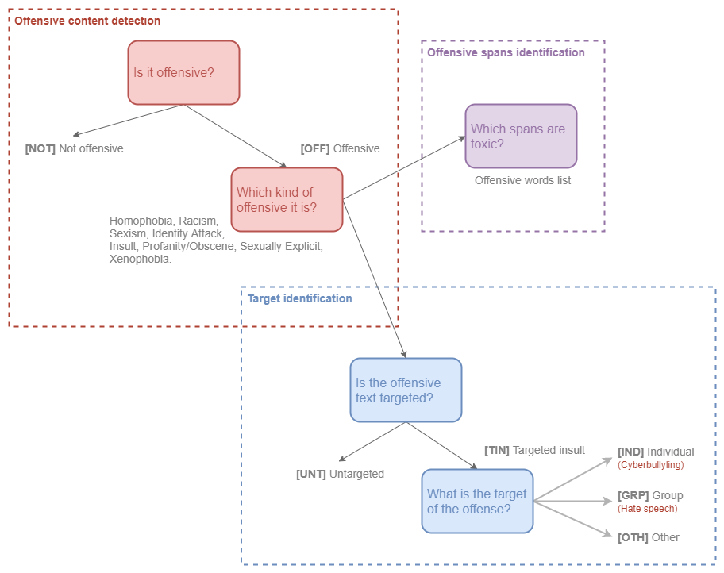

# OLID-BR Dataset

OLID-BR contains a collection of annotated sentences in Brazilian Portuguese using an annotation model that encompasses the following levels:

- Offensive content detection
- Offensive target identification
- Offensive spans identification

<figure>
  
  <figcaption>Categorization - Image by author.</figcaption>
</figure>

## Categorization

### Offensive content detection

Is it an offensive sentence?

- `OFF` Offensive: Inappropriate language, insults, or threats.
- `NOT` Not offensive: No offense or profanity.

### Offensive category identification

Which category of offensive content is it?

`Homophobia`, `Racism`, `Sexism`, `Identity Attack`, `Insult`, `Profanity`, `Sexually Explicit`, and `Xenophobia`.

See the [glossary](../glossary.md) for more information.

### Offensive target detection

Is the offensive text targeted?

- `TIN` Targeted Insult: Targeted insult or threat towards an individual, a group or other.
- `UNT` Untargeted: Non-targeted profanity and swearing.

### Offensive target identification

What is the target?

- `IND` The offense targets an individual, often defined as “cyberbullying”.
- `GRP` The offense targets a group of people based on ethnicity, gender, sexual
- `OTH` The target can belong to other categories, such as an organization, an event, an issue, etc.

### Offensive spans identification

As toxic span we define a sequence of words that attribute to the text's toxicity. Consider, for example, the following text:

=== "English"
    > "This is a `stupid` example, so thank you for nothing `a!@#!@.`"

    The toxic spans are:

    ```python
    ["stupid", "a!@#!@."]
    ```

=== "Portuguese"
    > "Esse é um exemplo `estúpido`, então obrigado por nada `a!@#!@.`"

    The toxic spans are:

    ```python
    ["estúpido", "a!@#!@."]
    ```

[^1]: Weng, L. (2021, March 21). Reducing toxicity in language models. Lil'Log. https://lilianweng.github.io/lil-log/2021/03/21/reducing-toxicity-in-language-models.html.
[^2]: Zampieri et al. "Predicting the type and target of offensive posts in social media." NAACL 2019.
[^3]: João A. Leite, Diego F. Silva, Kalina Bontcheva, Carolina Scarton (2020): Toxic Language Detection in Social Media for Brazilian Portuguese: New Dataset and Multilingual Analysis. Published at AACL-IJCNLP 2020.