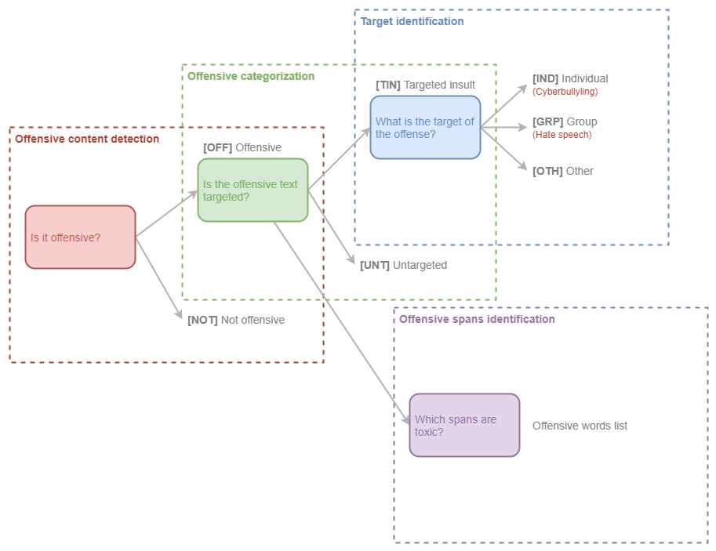

OLID-BR contains a collection of annotated sentences in Brazilian Portuguese using an annotation model that encompasses the following levels:

- Offensive content detection
- Offensive categorization
- Target identification
- Offensive spans identification



## Categorization

### Offensive content detection

Is it an offensive sentence?

- `OFF` Offensive: Inappropriate language, insults, or threats.
- `NOT` Not offensive: No offense or profanity.

### Offensive categorization

Is the offensive text targeted?

- `TIN` Targeted Insult: Targeted insult or threat towards an individual, a group or other.
- `UNT` Untargeted: Non-targeted profanity and swearing.

### Target identification

What is the target?

- `IND` The offense targets an individual, often defined as “cyberbullying”.
- `GRP` The offense targets a group of people based on ethnicity, gender, sexual
- `OTH` The target can belong to other categories, such as an organization, an event, an issue, etc.

### Offensive spans identification

As toxic span we define a sequence of words that attribute to the text's toxicity. Consider, for example, the following text:

> "This is a `stupid` example, so thank you for nothing `a!@#!@.`"

The toxic spans are:

```python
["stupid", "a!@#!@."]
```