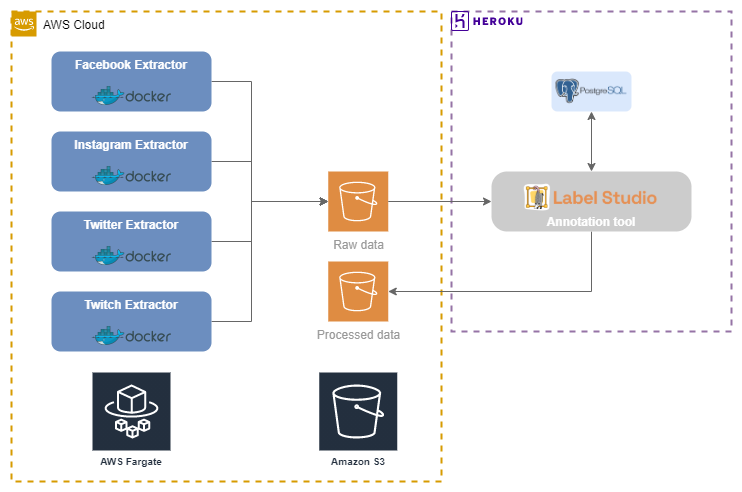

# Data Pipeline

In this section, we will describe the [**data pipeline**]{A data pipeline is a series of data processing steps.} used to generate the dataset.

## Data Source

We want to collect comments from different sources, such as:

- Instagram
- Facebook
- Twitter
- Twitch

For each source, we defined a set of public profiles that we want to collect comments from. To maintain privacy, we won't share the profile names.

## Architecture

The following diagram shows the architecture of the [**data pipeline**]{A data pipeline is a series of data processing steps.}.

<figure>
  
  <figcaption>Architecture - Image by author.</figcaption>
</figure>

## Filtering

We want to filter out comments that are not relevant to the scope of the dataset.

- Comments must be in Portuguese.
- Comments that have one or more related keywords.

## Privacy

We will apply some privacy policies to the comments collected from each source directly in the ingestion pipeline.

- User mentions were replaced with the word "@USER".
- URLs were replaced with the word "URL".
