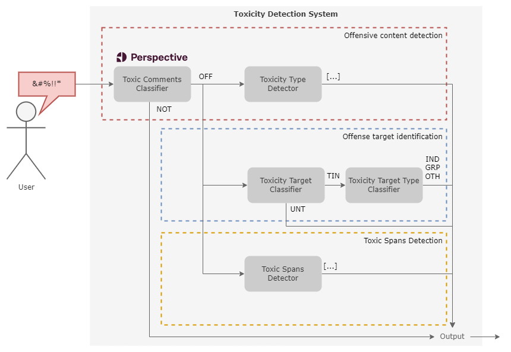

ToChiquinho is a tool for detecting toxicity in text in Brazilian Portuguese. It's based on several models trained on [OLID-BR](https://dougtrajano.github.io/olid-br/) dataset.

ToChiquinho provides several methods to detect toxicity in text such as:

- **Toxicity Type Detection**: Detects the type of toxicity in text.
- **Toxicity Target Classification**: Detects if the text is targeted or not.
- **Toxicity Target Type Identification**: Identifies the type of toxicity in text (individual, group, or other).
- **Toxic Spans Detection**: Detects the spans of toxicity in text.

## Architecture

<figure>
  
  <figcaption>ToChiquinho architecture</figcaption>
</figure>

## Motivation

Today, we are living in a world where the internet is becoming more and more important for our lives.

So, we want to ensure healthy online communication between people. You can expose your opinion, but it should be respectful with others.